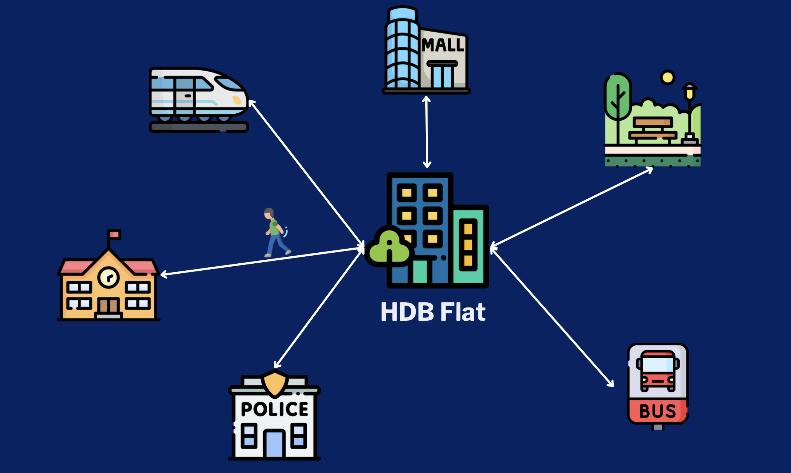
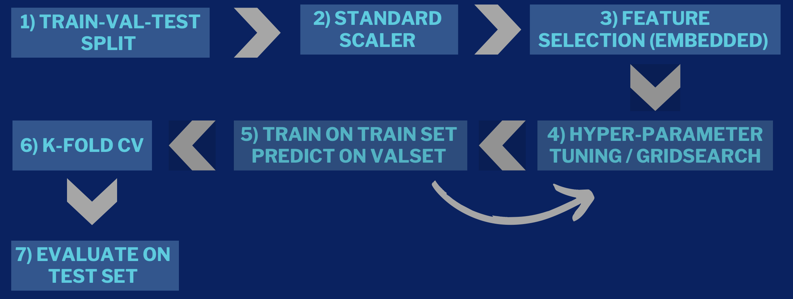

<h1>HDB Resale Price Prediction (2012 to 2021)</h1>

A Comprehensive Guide to training classification models to predict HDB resale flats in Singapore.

<!---Project Motivation-->
<h2>Motivation</h2>

In Singapore's vibrant housing market, the resale sector of the Housing and Development Board (HDB) plays a pivotal role in meeting the diverse needs of residents. However, navigating this market landscape presents a formidable challenge, characterised by the intricate interplay of myriad factors influencing resale prices. Amidst this complexity, there exists a pressing need to <strong>leverage advanced analytical techniques to unravel the underlying dynamics and provide stakeholders with the insights necessary to make informed decisions</strong>.
 

Driven by the imperative to enhance market transparency and facilitate fair transactions, this project seeks to harness the power of machine learning and feature engineering to analyse and predict HDB resale prices accurately. By delving into the multifaceted factors shaping resale prices, we aim to develop robust predictive models that empower stakeholders with the foresight needed to navigate the market landscape confidently. Through this endeavour, we aspire to contribute to the evolution of a more transparent, efficient, and equitable housing ecosystem in Singapore.

<h2>Project Goal</h3>

The aim of this project is to analyse and predict Housing and Development Board (HDB) resale prices in Singapore. HDB resale prices are influenced by various factors such as the price of new HDB houses, nearby amenities, and neighbourhood crime rates. By leveraging machine learning techniques and feature engineering, we aim to identify the main factors affecting resale prices and develop predictive models to forecast these prices accurately.

<!---Methodology-->
<h2>Methodology</h2>

<h3>1. Data Sources</h3>

All raw data sources are extracted from <a href="https://beta.data.gov.sg">Singapore's open data platform</a>.

<h3>2. Data Extraction</h3>

We made use of <a href="https://www.onemap.gov.sg">OneMap API</a> to retrieve a list of coordinates of amenities and calculate the distance between amenity and HDB flat using Python <a href="https://geopy.readthedocs.io">GeoPy</a> library.

<h3>3. Data Pre-processing & EDA</h3>
We carry out the following pre-processing across the different datasets to ensure data consistency and quality before merging them together.
<ul>
<li>Remove duplicate rows</li>
<li>Drop unnecessary columns</li>
<li>Split up date column to get Year and Month</li>
<li>Concatenate Block and Street Name to get full address</li>
<li>Merge all the amenities data with HDB resale data</li>
</ul>
After Exploratory Data Analysis, this are the top distinct features with price:
<ol>
<li>Storey</li>
<li>Flat Type</li>
<li>Floor Area Square Metre</li>
<li>Year</li>
</ol>
There were other features that have a possible linear relationship with resale price such as distance to MRT station and distance to nearest mall. However the trend is not fully distinct based on the plots as these features are not the primary factors but instead are just some of the many considerations that influence the inconvenience of a particular flat. Hence, even though they do not have a very strong linear correlation with resale price, we have decided not to remove them from model training as the interaction between all these features could result in patterns that we are unable to observe through EDA.

<h3>4. Model Training</h3>

<h3>5. Model Performance</h3>
<table>
    <thead>
        <tr>
            <th>Model</th>
            <th>Mean Square Error</th>
            <th>Mean Absolute Error</th>    
            <th>R2-Score</th>
        </tr>
    </thead>
    <tbody>
        <tr>
            <td>Lasso Regression</td>
            <td>6025195388 </td>
            <td>57850</td>
            <td>0.72165</td>
        </tr>
        <tr>
            <td>Ridge Regression</td>
            <td>6025194994</td>
            <td>57858</td>
            <td>0.72165</td>
        </tr>
        <tr>
            <td>K Nearest Neighbour</td>
            <td>1615971029</td>
            <td>26848</td>
            <td>0.92535</td>
        </tr>
        <tr>
            <td>Decision Tree</td>
            <td>1126052155</td>
            <td>24093</td>
            <td>0.94798</td>
        </tr>
        <tr>
            <td>Random Forest</td>
            <td>814176143</td>
            <td>20835</td>
            <td>0.96239</td>
        </tr>
        <tr>
            <td>AdaBoost</td>
            <td>856806024</td>
            <td>21143</td>
            <td>0.96042</td>
        </tr>
        <tr>
            <td>XGBoost</td>
            <td>745534116</td>
            <td>20030</td>
            <td>0.96556</td>
        </tr>
    </tbody>
</table>

<!---Conclusion-->
<h2>Conclusion</h2>
In this project, we studied the HDB resale price in Singapore to build a model that can predict its price given a comprehensive set of parameters as the prices can be influenced by a range of different factors. <strong>We also managed to exercise our creativity and tap on existing publications in this domain to improve the quality of our datasets as well as model training:</strong>
<ol>
<li>We made use of the OneMap API to get the coordinates of educational institutions, shopping malls, police stations, green areas, MRT and bus stations and Singapore, and subsequently find the distance between them and the resale flats as we know that the prices are influenced by nearby amenities and public transport network. We also included crime rate data by town as we believe that this could also affect the price of resale flat in the area. This feature extraction process enriched our dataset and allowed our model to learn the data better.</li>
   
<li>Instead of doing one-hot encoding for all our categorical features (e.g. town, nearest MRT) which will blow up the dimensionality of our dataset (leading to curse of dimensionality), we implemented a novel method of encoding them by first grouping them by the categorical feature and taking the median price of each group minus the overall median price of the dataset and finally doing a min-max normalization to get an index representing each group in the feature. The group with a higher median price will have a higher index which also represent that flats in that group are generally more expensive and considered more "upmarket".</li>

<li>We trained multiple ML models and came up with a rigorous and robust methodology to fine-tune each model by looking into each of their hyper-parameters. We were able to significantly improve the final performance of the models compared to the baseline model after the fine-tuning process. We also implemented good ML techniques and practices in our training process by utilizing train-val-test split, feature selection and cross-validation.</li>
</ol>

<strong>However, we also recognized that there are still room for improvements in our project:</strong>
<ol>
<li>Since our dataset include a wide range of years from 2012 to 2021, we did not consider that some of the amenities such as MRT station and malls may not be built there yet hence there could be inaccuracies in our data leading to bias and noise. Moving forward, we can just collect more datapoints for one particular year alone which will allow us to filter out the amenitites that have been built there at the point of the resale</li>
   
<li>We did not consider economic and political factors in our data such as inflation rate and the change in housing policies as it makes the data processing too complex for our project and may lead to more errors. However, we do recognise that it is an important aspect that could affect the prices of resale flat drastically. While it is not substantial, including year as a feature inside the data could contain some information on these factors. For example, resale flats sold in 2021 could all be much higher compared to previous years due to Covid and similarly those sold in 2024 will also be higher due to increase in GST. Nevertheless, moving forward we can explicitly include economic and political features inside the data to make it even more robust.</li>
</ol>

<h2>Libraries</h3>
<!-- markdownlint-disable MD033 -->
<!-- The lack of line breaks within anchor tags is due to a weird underline appearing when line breaks are present. -->

  &nbsp;
  
  &nbsp;
  
  &nbsp;
  
  &nbsp;
  
  &nbsp;
  

<!-- markdownlint-enable MD033 -->